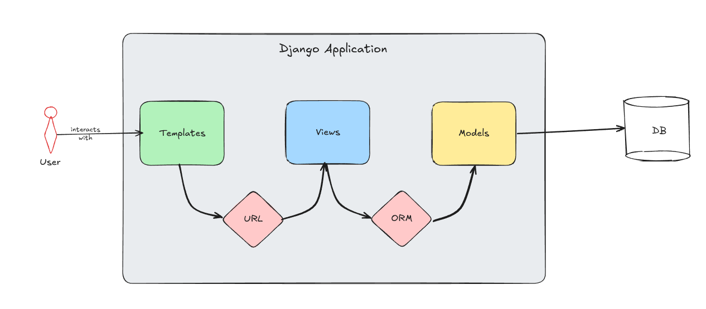

# Intro to Modern App dev - Lecture **3**

## Lecture summary:

1. Setting up a django project
2. The project HQ (settings.py & main urls.py)
3. Essential settings & configurations
4. Using .env files for secrets
5. MVT architecture, URLs, ORM
6. Setting up django apps
7. Designing URLs
8. Setting up templates & jinja
9. Connecting Models, Views, Templates

## Setting up a Django project (revisit from lecture 2)

Django is a python web framework.

### Steps to set up a new django project

1. Please follow all the steps from Using uv section. In dependencies, add "django" and run the sync command. Activate virtual env.
2. Delete `main.py`. We do not need this for django.
3. Run `django-admin startproject <project_name> .` This will set up the project in the same directory where uv project was set up. Again, PLEASE ENSURE CORRECT DIRECTORY.
4. This will create two artifacts: a python script `manage.py` and a python module with the provided project name. 
5. Once step 4 is complete, we can test the setup by running the in-built development server. Run
`uv run manage.py runserver`. This should launch a server on `127.0.0.1:8000`. You should see the following 

## The settings.py file

This is the main brain of the project, residing in the head project directory.
All essential settings inlcuding databases, templates, deployements, etc are managed here. 

Important settings:
* SECRET_KEY: A key used by django to hash and encrypt passwords
* DEBUG: Setting info level for logging
* INSTALLED_APPS: All associated apps in the project (default + user created)
* TEMPLATES: Specify directory path for template files
* STATIC_FILES: Specify path for static files

There are other several settings which we will explore as we go deeper into the setup

## Using .env file

This is the best way to manage credentials, keys and other sensitive data. Another important way of using environment variables is to configure settings. This practice lets you change settings without making changes to the code (for instance, you can set DEBUG through env)

PLEASE FOLLOW THIS PRACTICE WIHTOUT FAIL. **VERY CRUCIAL**

## MVT Architecture

* Models: Data classes that become a table in the Database. An instance of this class is a row in the table
* Views: The core logic that connects Models with Templates
* ORM: Object-Relational Mapper that is a set of django in-built modules that help you interact with the database. This connects Views with Models.
* Templates: HTML files that display the information using Jinja, python's template engine
* URL: Uniform Resource Locator that maps templates with views. Users use URL to access specific templates

